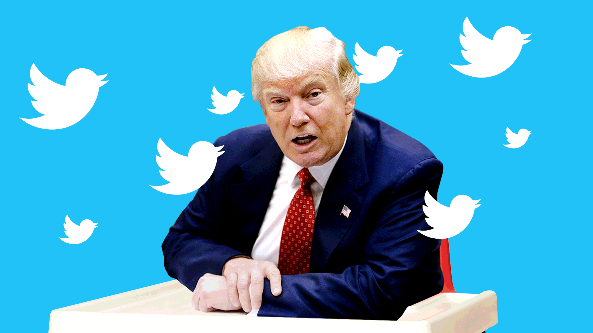
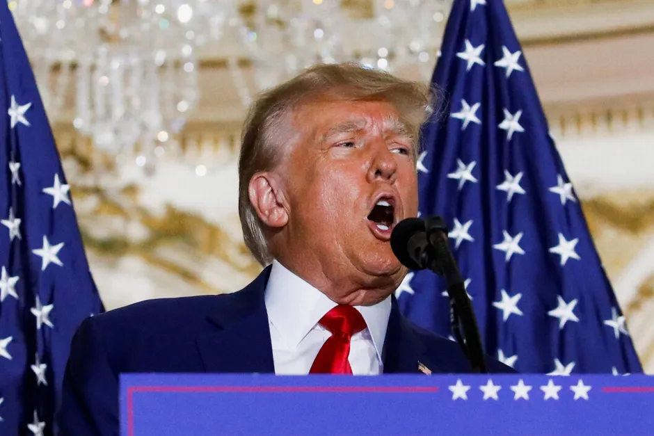
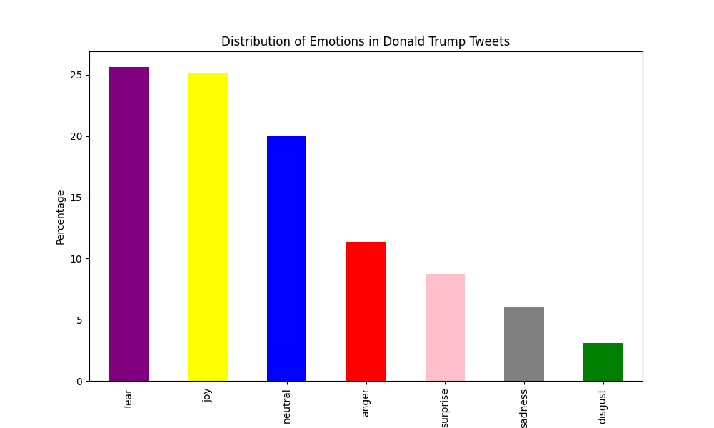

# Assignement 5 - Donald trump tweets sentiment analysis and text generation using RNNs (self assigned)

---
## Introduction and contents

It was an huge loss for the social media platform twitter when Donald Trump on the 8th of january was banned for inciting violence. (sarcasm might be relevant for this statement) and even after being unbanned the orange man still refuses to make this return to the platform, therefore it is crucial that we replicate his existence. For this reason i have opted to create an rnn model that will replicate donalds tweets in hopes that this can fullfill the void that was left behind.. Sadly as of making this github repository i originally created a new twitter account that would tweet out the statements created by this bot, but with the new twitter api it is not possible unless a significant amount of money is spent on this project or an academic grant is given. Sadly, i highly doubt the upper management of twitter would deem this an academic achievement.

On top of the text generation there is also a script called emotion_test.py which generates sentiment analysis of the tweets showing their emotions and graphs it visualize.

In this repository you will find three files, "emotion_test.py", "generate_tweet.py" and "train_model.py" that all serve different purposes. First, Train_model.py trains a model and saves it and generate_tweet.py uses the trained model to generate text. the third emotion_test.py generates the emotion behind the texts and graphs it out.
 

## data
The model for this project was trained using the "Trump Tweets" dataset which can be found here : https://www.kaggle.com/datasets/austinreese/trump-tweets. The dataset consists of 41000 tweets from donald trump before his removal from twitter. The data can be found in the data folder.

## models  
similar to assignement 3, a recurrent neural network (RNN) architecture following a Long Short-Term Memory (LSTM) path is followed for the text generation. similar to assignment 4 The model used for emotional classificaion is the "j-hartmann/emotion-english-distilroberta-base" transformer model from the platform hugginface which can be found here : https://huggingface.co/j-hartmann/emotion-english-distilroberta-base which predicts the 6 basic emotions. 

## script functions
The train_model.py function does the following
1. imports dependencies and loads the data.
2. preprocesses and tokenizes the data
3. Trains an RNN LSTM model and saves it to the model folder

the generate_tweet.py function does the following
1. loads the model and the tokenizer
2. asks the user for an input and length of the response
3. generates text based on inputs recieved

the emotion_test.py function does the following.
1. Import the necessary libraries
2. Initializes the model 
3. Loads the dataset
4. Performs emotion classification on the tweets
5. Plots the distribution and saves it to the "out" folder along with a csv file with the emotions listed as well.

## how to replicate
### copy the repository 
git clone https://github.com/Olihaha/assignment5

make sure to be in correct directory

(cd assignment5)

### scripts 
Run setup.sh followed up by train_model.sh, generate_tweet.sh or emotions.sh

setup.sh activates a virtual environment, pip installs necessary libraries and deactives.

train_model.sh activates the virtual environment, runs the training model script, saves the model and deactives itself again.

generate_tweet.sh activates the virtual environment and runs the script generating code with the included model.

I need to warn that all of the scripts except generate_tweet.sh take a while to run! even the emotion classifcaiton takes upwards of 1,5 hours.

## results
Just a few examples of generated texts

Generated Text: (input: hello)
Hhello Time Nyc Plan Got Karlrove Why After Released To Go Marriage He Lobbied Debbie Disgraceful

Generated Text: (input: grab her by )
Grab Her By Do I Run Not Really Again The Best Numbers Have You American Control Our Will

Generated Text: (input: hillary clinton)
hillary clinton is being that place returns and unfair and get bad to make

Generated Text: (input: covid)
covid announced is a total guy bushy to the family haul

Generated Text: (input: fake news)
fake news realdonaldtrump defending to see tomorrow a fool of construction

Generated Text: (input: its amazing)
its amazing cruz falsely to motto of foxandfriends hatemail in the great state expecting of our who she else gennifer 

Generated Text: (input: clinton is)
Clinton is unwatchable herald to the american one a horrible for trump with great the biggest trump2016

It seems that while the generator is not terrible, it defintly needs some more work before it fools anyone, but i cant deny that its given me a few chuckles at some of the answers. Especially the bot combining the Nba and isis is pretty funny.

## emotions

The emotions displayed are not surprising and somewhat similar to what i would have expected. A vast majority of the tweets display either fear or joy, which is somewhat also what would have been expected. Fear might not at first glance be something you would hope for a politician to spread, but trump is not like the average politician. In my opinion, trump as a politician thrives on creating chaos and higlighting the weakness in the opposing side. For this reason, i am not surprised to see fear as the ruling emotion. Second and closely we have joy. I would assume that this emotion is so dominant becuase of trumps success in the 2016 election, his twitter most likely will have been filled with positive tweets for that reason.

On a final note i would like to reminiscene about what could have been. instead of having a great donald trump bot we are instead left with an empty twitter account. twitter user @olisdonald6703 will never be able to exist unless Elon Musk lifts the restrictions placed in february.